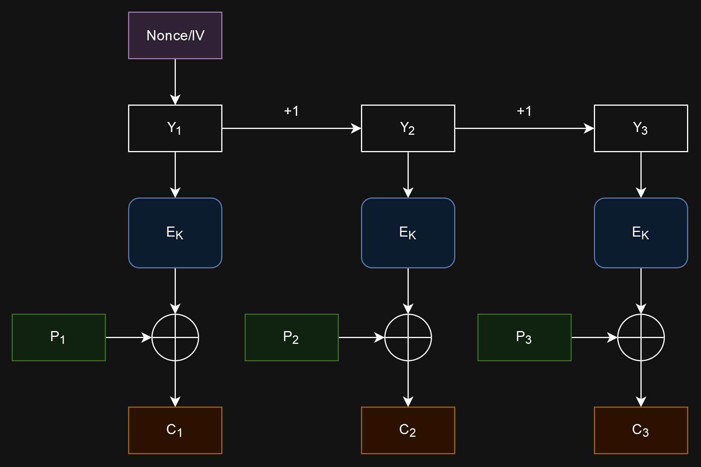

# haki-tako-game | LINE CTF 2024

## Initial steps

Reading the provided code, we can see that when we connect to the server,

1. A new random 256-byte PIN and 32-byte AES key are generated,
2. The PIN is put inside a string `b'Your authentication code is..' + pin + b'. Do not tell anyone and you should keep it secret!'`,
3. The resulting plaintext message is encrypted using AES in GCM mode using a new random 12-byte nonce, and
4. The resulting ciphertext, nonce, and tag are given to us.

Afterwards, the server repeatedly accepts inputs in hexadecimal and can provide potentially useful outputs for us.

* If the input length is 512 hex digits or less, equivalent to 256 bytes, then the input is checked against the PIN. If the PIN is correct, then we are given the flag. Whether the PIN is correct or not, the connection is closed.
    * This means that we have only one shot to give the correct PIN per connection, because another connection will have a different random PIN.
* If the input length is less than or equal to `msg_block_len_in_hex+32`, then we are given the result of decrypting the input with AES in CFB mode with the same key generated previously. However, in each block (16 bytes for AES) of the decryption result, the last two bytes are zeroed out.
* Otherwise, if the input length is longer than `msg_block_len_in_hex+32`, then we are given the result of decrypting the input with AES in CBC mode, also with the same key. Here, none of the result is removed.

We need to find some clever way to use the given CFB and CBC decryption oracle to recover the plaintext PIN. But how?

## GCM, CFB, and CBC

Block ciphers such as AES can only operate on fixed-size blocks of messages. Therefore, when encrypting a plaintext that is longer than the block size, a block cipher mode of operation needs to be used, such as GCM, CFB, and CBC. I used this Wikipedia article with excellent diagrams to learn how these modes work (https://en.wikipedia.org/wiki/Block_cipher_mode_of_operation), but I will also give explanations here.

### GCM (Galois/counter mode)

This paper in section 2.3 explains GCM encryption (https://csrc.nist.rip/groups/ST/toolkit/BCM/documents/proposedmodes/gcm/gcm-spec.pdf).

Let
* $IV$ be the initialization vector/nonce,
* $P_i$ the plaintext blocks,
* $C_i$ the ciphertext blocks,
* $Y_i$ the counters for each block,
* $E_K(x)$ the result of encrypting the block $x$ with the key $K$,
* $\mathrm{len}(x)$ the bit length of $x$, and
* $\oplus$ the bitwise XOR operator.

GCM encryption is done by the following formulas:

$$
\begin{align*}

Y_0 &= \begin{cases}
    IV\ ||\ 0^{31} 1 & \text{if } \mathrm{len}(IV) = 96 \\
    \ldots & \text{o.w.}
\end{cases} \\

Y_i &= Y_{i-1} + 1 \\

C_i &= E_K(Y_i) \oplus P_i

\end{align*}
$$

GCM has other steps related to authenticity that are not described here, but we will see that they are not necessary to decrypt the PIN.

GCM effectively turns the block cipher into a stream cipher by using the block cipher to generate a keystream. As in a stream cipher, the plaintext is bitwise XORed with the keystream to produce the ciphertext.

The case where the IV is not 12 bytes has been omitted in the previous formula, since in this challenge, the nonce/IV used in the PIN encryption is 12 bytes. This makes it easy for us to compute the initial counter $Y_0$ value, which will be useful.

### CFB (Cipher feedback)

### CBC (Cipher block chaining)

