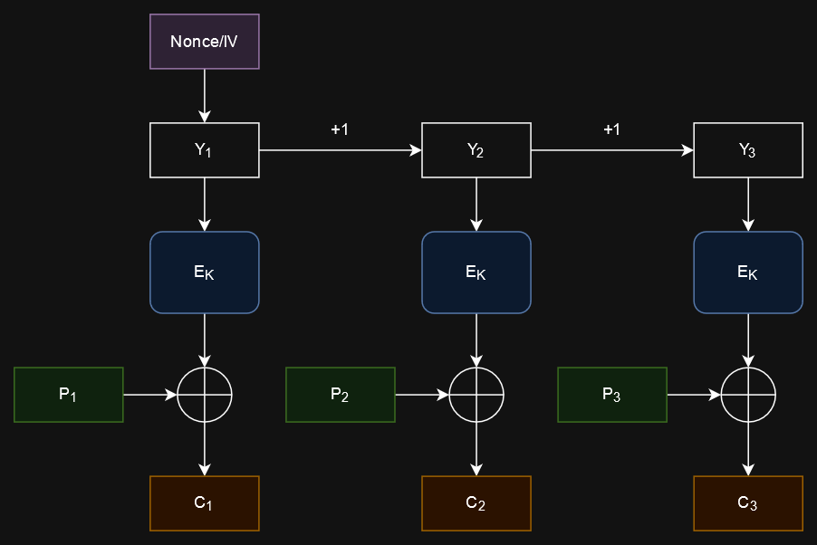
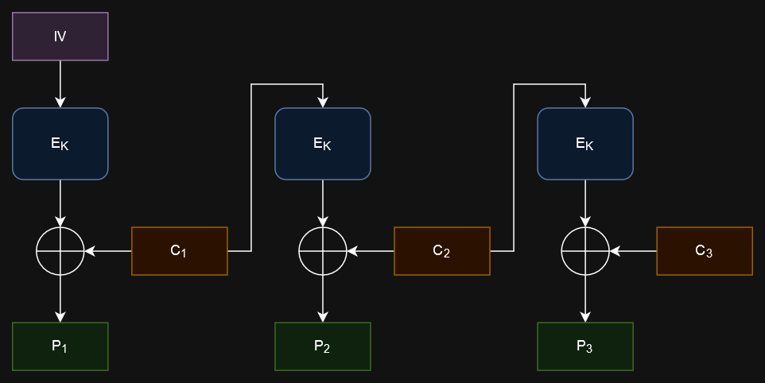
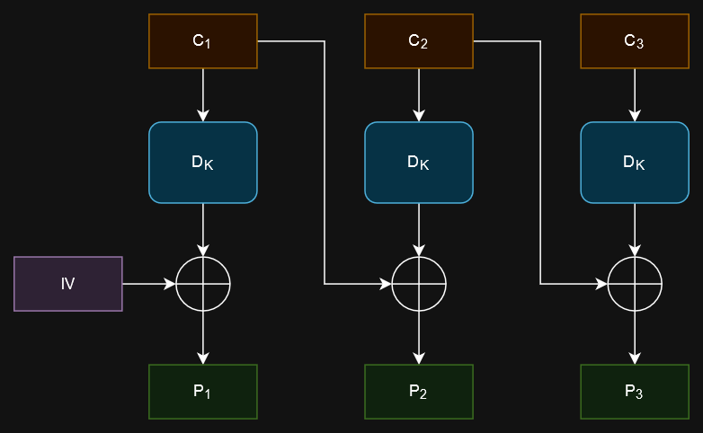
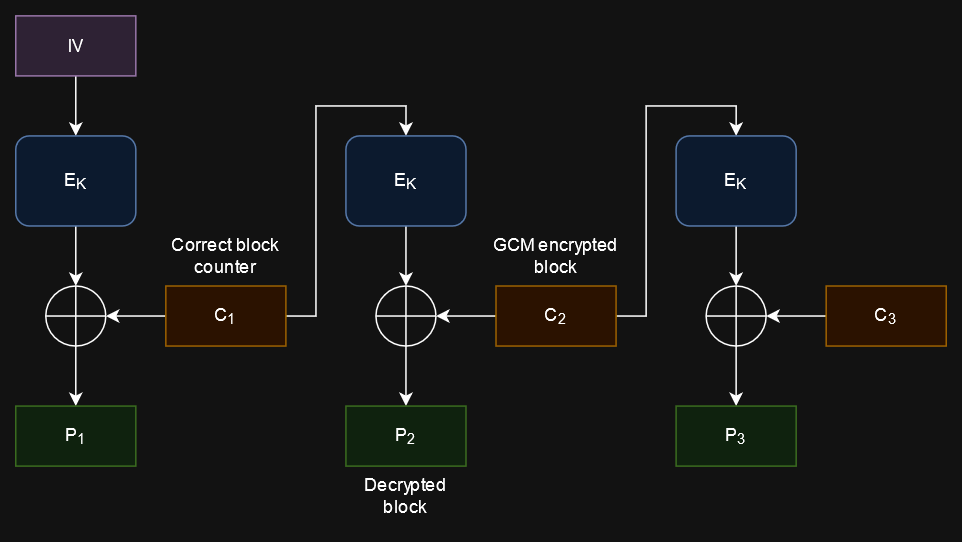
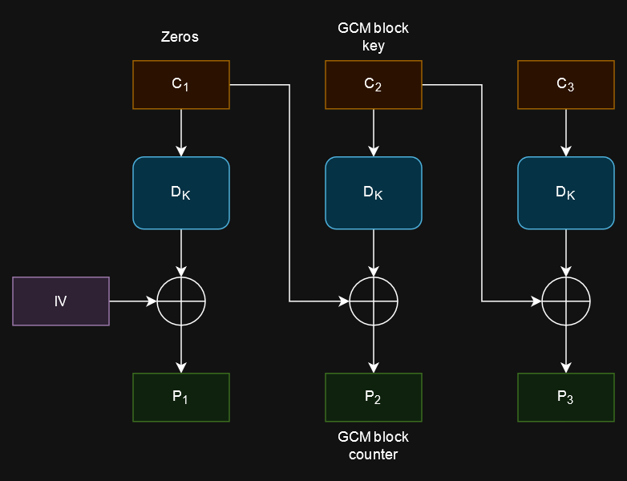
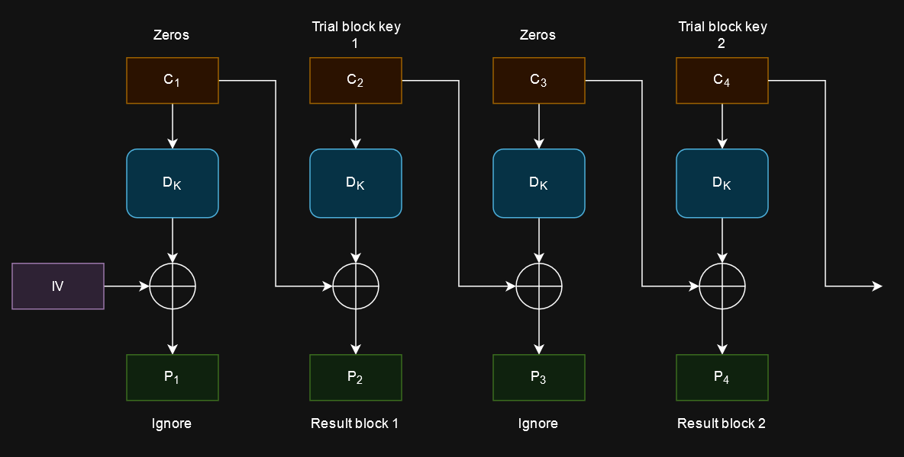

# haki-tako-game | LINE CTF 2024

> [!NOTE]
> If you see weird "Unable to render expression" errors, try opening the README.md file. https://github.com/hecarson/linectf-2024-writeups/blob/master/haki-tako-game/README.md

## Initial analysis

We are given `challenge_server.py` and `crypto.py`. Reading the provided code, we can see that when we connect to the server,

1. A new random 256-byte PIN and 32-byte AES key are generated,
2. The PIN is put inside a string `b'Your authentication code is..' + pin + b'. Do not tell anyone and you should keep it secret!'`,
3. The resulting plaintext message is encrypted using AES in GCM mode using a new random 12-byte nonce, and
4. The resulting ciphertext, nonce, and tag are given to us.

Afterwards, the server repeatedly accepts inputs in hexadecimal and can provide potentially useful outputs for us.

* If the input length is 512 hex digits or less, equivalent to 256 bytes, then the input is checked against the PIN. If the PIN is correct, then we are given the flag. Whether the PIN is correct or not, the connection is closed.
    * This means that we have only one shot to give the correct PIN per connection, because another connection will have a different random PIN.
* If the input length is less than or equal to `msg_block_len_in_hex+32`, then we are given the result of decrypting the input with AES in CFB mode with the same key generated previously. However, in each block (16 bytes for AES) of the decryption result, the last two bytes are zeroed out.
* Otherwise, if the input length is longer than `msg_block_len_in_hex+32`, then we are given the result of decrypting the input with AES in CBC mode, also with the same key. Here, none of the result is removed.

We need to find some clever way to use the given CFB and CBC decryption oracle to recover the plaintext PIN. But how?

## GCM, CFB, and CBC

Block ciphers such as AES can only operate on fixed-size blocks of messages. Therefore, when encrypting a plaintext that is longer than the block size, a block cipher mode of operation needs to be used, such as GCM, CFB, and CBC. I used this Wikipedia article with excellent diagrams to learn how these modes work (https://en.wikipedia.org/wiki/Block_cipher_mode_of_operation), but I will also give explanations here.

### GCM (Galois/counter mode) encryption

This paper in section 2.3 explains GCM encryption (https://csrc.nist.rip/groups/ST/toolkit/BCM/documents/proposedmodes/gcm/gcm-spec.pdf).

Let
* $IV$ be the initialization vector/nonce,
* $P_i$ the plaintext blocks,
* $C_i$ the ciphertext blocks,
* $Y_i$ the counters for each block,
* $E_K(x)$ the result of encrypting the block $x$ with the key $K$,
* $\mathrm{len}(x)$ the bit length of $x$, and
* $\oplus$ the bitwise XOR operator.

GCM encryption is done by the following formulas:

$$
\begin{align*}
Y_0 &= \begin{cases}
    IV\ ||\ 0^{31} 1 & \text{if } \mathrm{len}(IV) = 96 \\
    \ldots & \text{o.w.}
\end{cases} \\
Y_i &= Y_{i-1} + 1 \\
C_i &= E_K(Y_i) \oplus P_i
\end{align*}
$$



GCM has other steps related to authenticity that are not described here, but we will see that they are not necessary to decrypt the PIN.

GCM effectively turns the block cipher into a stream cipher by using the block cipher to generate a keystream. As with a stream cipher, the plaintext is bitwise XORed with the keystream to produce the ciphertext.

> [!NOTE]
> Let's define a "block key" to be a result from $E_K$ that is XORed with a plaintext/ciphertext block.

The case where the IV is not 12 bytes has been omitted in the previous formula, since in this challenge, the nonce/IV used in the PIN encryption is 12 bytes. This makes it easy for us to compute the initial counter $Y_0$ value, which will be useful.

### CFB (Cipher feedback) decryption

Let
* $IV$ be the initialization vector,
* $P_i$ the plaintext blocks,
* $C_i$ the ciphertext blocks,
* $E_K(x)$ the result of encrypting the block $x$ with the key $K$, and
* $\oplus$ the bitwise XOR operator.

The use of block encryption for CFB decryption is not a typo.

CFB decryption is done by the following formulas:

$$
\begin{align*}
P_1 &= C_1 \oplus E_K(IV) \\
P_i &= C_i \oplus E_K(C_{i-1})
\end{align*}
$$



CFB is similar to GCM in how it also effectively turns the block cipher into a stream cipher.

### CBC (Cipher block chaining) decryption

Let
* $IV$ be the initialization vector,
* $P_i$ the plaintext blocks,
* $C_i$ the ciphertext blocks,
* $D_K(x)$ the result of decrypting the block $x$ with the key $K$, and
* $\oplus$ the bitwise XOR operator.

CBC decryption is done by the following formulas:

$$
\begin{align*}
P_1 &= D_K(C_1) \oplus IV \\
P_i &= D_K(C_i) \oplus C_{i-1}
\end{align*}
$$



Unlike the other two modes, CBC does not turn the block cipher into a stream cipher.

## Using the CFB decryption oracle

In CFB decryption, a ciphertext block is XORed with the result of an $E_K$ block. This inspires a clever idea: using CFB decryption, if we set a ciphertext block $C_2$ to be a GCM-encrypted ciphertext block that we want to decrypt, and set the previous ciphertext block $C_1$ to be the correct GCM block counter, then the resulting second plaintext block $P_2$ will be the decrypted block that we wanted.



It is possible for us to compute the correct block counter, because the nonce used in encrypting the PIN message is given to us, and the nonce is used to derive the first counter value $Y_0$.

The block size of AES is 128 bits or 16 bytes. If we run this attack for every 16-byte block in the given ciphertext, then we can recover most of the plaintext containing the PIN.

```py
from pwnlib.tubes.remote import remote
import json

conn = remote("34.146.137.8", 11223)

line = conn.recvline()
info = json.loads(line)
nonce = info["nonce"]
nonce = bytes.fromhex(nonce)
ciphertext = info["ct"]
ciphertext = bytes.fromhex(ciphertext)
```

```py
# PIN is in 17 blocks starting from block 2 (second block)
for block_idx in range(1, 1 + 16 + 1):
    ct_block = ciphertext[block_idx * 16 : (block_idx + 1) * 16]
    # Use block_idx + 2, because last byte of Y_0 is 0x01, and Y_1 is used for the first plaintext block
    block_counter = nonce + (block_idx + 2).to_bytes(4)
    
    # Get partial plaintext block using CFB
    # Null bytes after ct_block are for lengthening the input to make the server do CFB decryption
    input_bytes = block_counter + ct_block + b"\x00" * (len(ciphertext) - 32)
    conn.send(input_bytes.hex().encode())
    line = conn.recvline()
    info = json.loads(line)
    res_hex = info["ret"]
    res = bytes.fromhex(res_hex)

    # Plaintext block is in second block of result
    partial_pt_block = res[16:32]
```

However, a problem is that when we send ciphertext to the server to decrypt using CFB, in each resulting plaintext block, the server replaces the last two bytes of the block with zero bytes. Brute forcing these unknown bytes by putting in PIN guesses is not viable, because there are $2^8 = 256$ possible values per byte, so $256^2 = 65536$ possible values per block, and $65536^{17} \approx 8 \times 10^{81}$ possible guesses, making a simple brute force attack infeasible.

The server does provide another form of decryption using the same key with CBC decryption, and none of the resulting bytes are hidden. Perhaps it can be useful.

## Brute forcing using the CBC decryption oracle

In CBC decryption, a ciphertext block $C_i$ is first decrypted with $D_K$, then XORed with the previous ciphertext block $C_{i-1}$. Observe that if we set a ciphertext block $C_i$ to a GCM block key, then the corresponding plaintext block $P_i$ will be the block counter $Y_i$ XORed with the previous ciphertext block $C_{i-1}$. If $C_{i-1}$ is set to all zeros, then the XOR will effectively do nothing.



Additionally, observe that if we have a full GCM block key for a ciphertext block $C_i$, then we can decrypt the block by XORing it with the block key to get the corresponding plaintext block $P_i$. Is there a way for us to find a full block key to fully decrypt a ciphertext block?

Another clever observation is that we can obtain a partial block key by XORing a partial plaintext block with the corresponding ciphertext block. In our case, since the last two bytes of each plaintext block is unknown, only the last two bytes of each block key will be unknown. Is it feasible to brute force these two unknown bytes?

For each partial block key with two unknown bytes, we can check whether a block key guess is correct with the CBC decryption oracle by checking whether the resulting block counter is correct, and we can compute the correct block counter for each block with the nonce. For each partial block key, since there are two unknown bytes, and 256 possible values for each byte, we need only a maximum of $256^2 = 65536$ trials to find the correct block key. Once we have the correct block key, we can fully decrypt the corresponding ciphertext block!

There is another problem, however. Notice that the server limits the number of requests per connection to 45000. If we are not careful with making decryption requests in this brute force attack, we will quickly exceed this limit, and the server will close the connection. Additionally, network requests are very slow, and we want to utilize each request as much as possible to save precious time - especially when you are desperately trying to get a flag 2 hours before a CTF competition ends, *and* the challenge server is in Japan while you are in the US.

## Efficiently using CBC decryption requests

To use each request efficiently, we can put multiple trial block keys in a ciphertext input. My approach during the CTF event was to use two ciphertext blocks $C_i$ and $C_{i+1}$ for each trial block key, set $C_i$ to all zeros, and set $C_{i+1}$ to the trial block key.



Each request has a maximum of 1024 hex digits, equivalent to 512 bytes. The block size for AES is 16 bytes, so this approach can fit $512 / 32 = 16$ trial block keys per request. There are $65536$ possible block keys per block, so a maximum of $65536 / 16 = 4096$ requests are needed per block to find the correct block key. On average, we can expect to make half the number of requests before finding the right block key, and there are 17 blocks that contain the PIN, so we can expect to make roughly $2048 \times 17 = 34816$ requests to decrypt the PIN, which is under the requests limit of 45000.

```py
def xor(a: bytes, b: bytes) -> bytes:
    return bytes([x ^ y for x, y in zip(a, b)])

# ...

plaintext_parts = []

for block_idx in range(1, 1 + 16 + 1):
    # ... Previous code for getting partial plaintext block ...
    partial_pt_block = res[16:32]

    # Brute force full block key using CBC
    # Put multiple trials of block keys into one request for efficiency
    partial_block_key = xor(ct_block, partial_pt_block)[:14]
    block_key = None
    num_trials = 256 ** 2 # 2 unknown bytes
    trials_per_request = 512 // 32 # Max request length is 1024 hex digits -> 512 bytes, 2 16-byte blocks per trial
    num_requests = num_trials // trials_per_request

    for request_idx in range(num_requests):
        if request_idx % 100 == 0:
            print("request idx", request_idx)

        # Make a request that has multiple trial block keys
        # NOTE: could be more efficient by using every block for a trial block key, zero blocks not needed
        input_bytes = bytearray()
        trial_block_keys = []
        for request_trial_idx in range(trials_per_request):
            # trial_idx ranges from 0 to 256^2 - 1
            trial_idx = request_trial_idx + trials_per_request * request_idx
            trial_block_key = partial_block_key + bytes([trial_idx // 256, trial_idx % 256])
            input_bytes.extend([0] * 16)
            input_bytes.extend(trial_block_key)
            trial_block_keys.append(trial_block_key)
        
        # Input is long enough to make server do CBC decryption
        conn.send(input_bytes.hex().encode())
        line = conn.recvline()
        info = json.loads(line)
        res_hex = info["ret"]
        res = bytes.fromhex(res_hex)

        # Search decryption result for the correct block counter to find block key
        for request_trial_idx in range(trials_per_request):
            trial_pt_block = res[request_trial_idx * 32 + 16 : (request_trial_idx + 1) * 32]
            if trial_pt_block == block_counter:
                block_key = trial_block_keys[request_trial_idx]
                print("found block key", block_key)
                break
        if block_key != None:
            break

    pt_block = xor(ct_block, block_key)
    print("plaintext block", pt_block)
    plaintext_parts.append(pt_block)
```

Finally, we have decrypted the PIN. We send it to the server to get our hard-earned flag.

```py
print()
plaintext = b"".join(plaintext_parts)
print("plaintext", plaintext)
print()
pin = plaintext[13 : -3]
print("pin", pin.hex())
print()

conn.send(pin.hex().encode())
# This line contains the flag
line = conn.recvline()
print(line)
```

The brute force attack with the CBC decryption oracle took me about 1 hour and 20 minutes of running time. The long running time is likely caused by the high network latency between the US and Japan. I got the flag about 17 minutes before the CTF event ended. Testing the solver code by running the challenge server on my local machine proved to be very wise - otherwise, I would have discovered minor bugs in my solver code at the end of the brute force attack, completely wasting that time.

In hindsight and after reading others' solutions, it is possible to use the CBC decryption even more efficiently. The zero blocks are not necessary, and each input ciphertext block can be used for a trial block key. Each result block $P_i$ would be XORed with the previous ciphertext block $C_{i-1}$, but this is easily undone by XORing the resulting $P_i$ with $C_{i-1}$ to get the potential block counter. This approach could cut the brute forcing time by half by making half the number of requests.

## Closing remarks

The full solver code can be found in `decrypt.py`. This challenge was pretty difficult for me, and had 48 solves in total. Previously learning about CBC bit flipping attacks, reading about block cipher modes of operation, and playing around in code with various modes of operation definitely helped me build the knowledge and intuition necessary for this challenge. Overall, the difficulty made it very fun to solve!